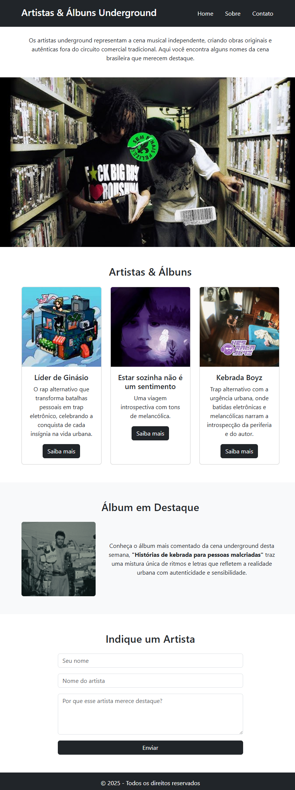
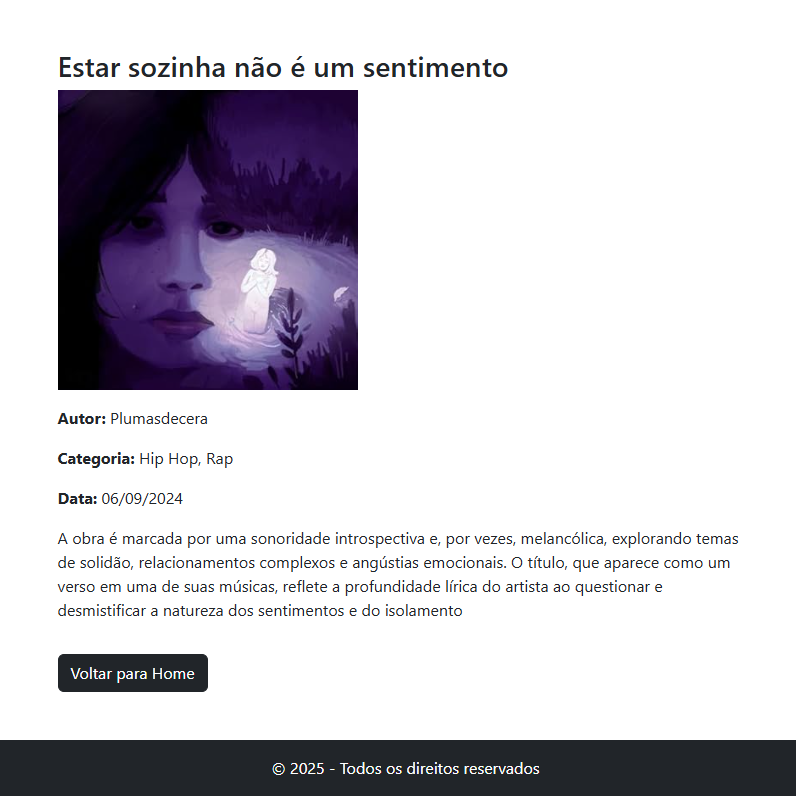

# Trabalho Prático 05 - Semanas 7 e 8

**Páginas de detalhes dinâmicas**

Nessa etapa, vamos evoluir o trabalho anterior, acrescentando a página de detalhes, conforme o  projeto escolhido. Imagine que a página principal (home-page) mostre um visão dos vários itens que existem no seu site. Ao clicar em um item, você é direcionado pra a página de detalhes. A página de detalhe vai mostrar todas as informações sobre o item do seu projeto. seja esse item uma notícia, filme, receita, lugar turístico ou evento.

Leia o enunciado completo no Canvas. 

**IMPORTANTE:** Assim como informado anteriormente, capriche na etapa pois você vai precisar dessa parte para as próximas semanas. 

**IMPORTANTE:** Você deve trabalhar e alterar apenas arquivos dentro da pasta **`public`,** mantendo os arquivos **`index.html`**, **`styles.css`** e **`app.js`** com estes nomes, conforme enunciado. Deixe todos os demais arquivos e pastas desse repositório inalterados. **PRESTE MUITA ATENÇÃO NISSO.**

## Informações Gerais

- Nome: Lucas Damacena de Souza 
- Matricula: 901048
- Proposta de projeto escolhida: artistas e álbuns underground brasileiros.
- Breve descrição sobre seu projeto: Projeto de site sobre artistas e álbuns underground brasileiros.

## Print da Home-Page



## Print da página de detalhes do item



## Cole aqui abaixo a estrutura JSON utilizada no app.js

```javascript
const dados = [
  {
    id: 1,
    titulo: "Líder de Ginásio",
    descricao: "O rap alternativo que transforma batalhas pessoais em trap eletrônico, celebrando a conquista de cada insígnia na vida urbana.",
    conteudo: "O álbum Líder de Ginásio, lançado por virgingod* em 2022, é uma obra que utiliza o universo de Pokémon como uma metáfora para jornadas pessoais. A coletânea de 13 faixas, com pouco mais de 25 minutos de duração, explora temas de autodescoberta e desafios emocionais.",
    categoria: "Plugg, Rap",
    autor: "Virgingod*",
    data: "25/11/2022",
    imagem: "img/liderdeginasio.png"
  },
  {
    id: 2,
    titulo: "Estar sozinha não é um sentimento",
    descricao: "Uma viagem introspectiva com tons de melancólica.",
    conteudo: "A obra é marcada por uma sonoridade introspectiva e, por vezes, melancólica, explorando temas de solidão, relacionamentos complexos e angústias emocionais. O título, que aparece como um verso em uma de suas músicas, reflete a profundidade lírica do artista ao questionar e desmistificar a natureza dos sentimentos e do isolamento",
    categoria: "Hip Hop, Rap",
    autor: "Plumasdecera",
    data: "06/09/2024",
    imagem: "img/plumasdecera.png"
  },
  {
    id: 3,
    titulo: "Kebrada Boyz",
    descricao: "Trap alternativo com a urgência urbana, onde batidas eletrônicas e melancólicas narram a introspecção da periferia e do autor.",
    conteudo: "É uma obra marcada por uma sonoridade de Trap melancólico (ou sad trap), onde as letras misturam a realidade da periferia (quebrada) com temas de angústia, tristeza e introspecção.",
    categoria: "Rap, Trap",
    autor: "Linkdozap",
    data: "11/08/2022",
    imagem: "img/linkdozap.png"
  }
];
const container = document.getElementById("lista-albuns");
if (container) {
  dados.forEach(item => {
    const card = document.createElement("div");
    card.classList.add("col-md-4");
    card.innerHTML = `
      <article class="card h-100 text-center">
        
        <div class="card-body">
          <h5 class="card-title">${item.titulo}</h5>
          <p class="card-text">${item.descricao}</p>
          <a href="detalhes.html?id=${item.id}" class="btn btn-dark">Saiba mais</a>
        </div>
      </article>
    `;
    container.appendChild(card);
  });
}

const detalhesContainer = document.getElementById("detalhes");
if (detalhesContainer) {
  const params = new URLSearchParams(window.location.search);
  const id = Number(params.get("id"));

  const item = dados.find(d => d.id === id);

  if (item) {
    detalhesContainer.innerHTML = `
      <h2>${item.titulo}</h2>
      
      <p><strong>Autor:</strong> ${item.autor}</p>
      <p><strong>Categoria:</strong> ${item.categoria}</p>
      <p><strong>Data:</strong> ${item.data}</p>
      <p>${item.conteudo}</p>
      <a href="index.html" class="btn btn-dark mt-3">Voltar para Home</a>
    `;
  } else {
    detalhesContainer.innerHTML = "<p>Álbum não encontrado.</p>";
  }
}
```
